[Home](index.html) | [Papers](papers.html) | [Presentations](presentations.html) | [Participants](participants.html) | [News](news.html)

# Participants
This is a list of all RAMSES participants (by alphabetical order of last name). 

## PIs

[Ian Foster, Argonne National Laboratory](http://www.mcs.anl.gov/person/ian-t-foster) (RAMSES-1 and RAMSES-2)

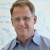

Ian Foster is Director of the Computation Institute, a joint institute of the University of Chicago and Argonne National Laboratory. He is also an Argonne Senior Scientist and Distinguished Fellow and the Arthur Holly Compton Distinguished Service Professor of Computer Science. Methods and software developed under his leadership underpin many large national and international cyberinfrastructures. Ian's research interests include distributed, parallel, and data-intensive computing technology, as well as innovative applications of computing technologies to scientific problems. 

---
[Rajkumar Kettimuthu, Argonne National Laboratory](http://www.mcs.anl.gov/~kettimut/) (RAMSES-1 and RAMSES-2)

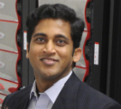

Rajkumar Kettimuthu is a Computer Scientist at Mathematics and Computer Science Division at Argonne National Laboratory and a Senior Fellow at the Computation Institue at The University of Chicago and Argonne National Laboratory. 

---
[Nagi Rao, Oak Ridge National Laboratory](http://www.csm.ornl.gov/~nrao/) (RAMSES-1 and RAMSES-2)

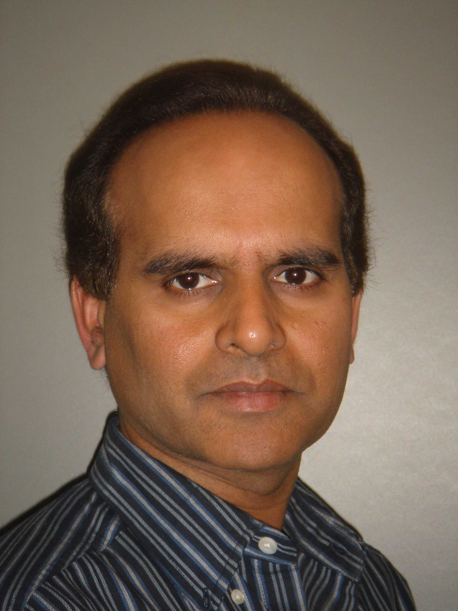

Nageswara (Nagi) S. V. Rao is a Corporate Fellow in Computer Science and Mathematics Division, Oak Ridge National Laboratory, where he joined in 1993. He received PhD in Computer Science from Louisiana State University in 1988. He published more than 350 technical conference and journal papers in the areas of sensor networks, information fusion and high-performance networking. He is a Fellow of IEEE, and received 2005 IEEE Technical Achievement Award and 2014 R&D 100 Award. 

---
[Brian Tierney, Lawrence Berkeley National Laboratory](http://www.es.net/about/esnet-staff/advanced-network-technologies/Brian-Tierney/) (RAMSES-1)

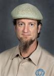

BrianL. Tierney is a Staff Scientist and group leader of the ESnet Advanced Network Technologies Group at Lawrence Berkeley National Laboratory (LBNL), and is PI of ESnet's 100G Network Testbed Project. His research interests include high-performance networking and network protocols; distributed system performance monitoring and analysis; network tuning issues; and the application of distributed computing to problems in science and engineering. Brian has been at LBNL since 1990.

---
[Don Towsley, University of Massachusetts - Amherst](https://www.cs.umass.edu/faculty/directory/towsley_donald) (RAMSES-1)

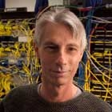

Don Towsley is a Distinguished University Professor in the College of Information and Computer Sciences at the University of Massachusetts - Amherst.  Don's research spans the areas of mathematical modeling, optimization, and control of large-scale networks. 

## Investigators

[Prasanna Balaprakash, Argonne National Laboratory](http://www.mcs.anl.gov/~pbalapra) (RAMSES-1 and RAMSES-2)

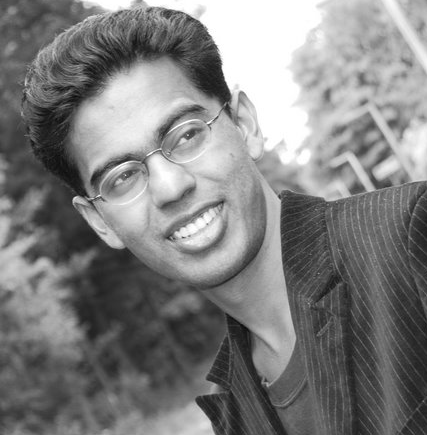

Prasanna Balaprakash is an assistant computer scientist with a joint appointment in the Mathematics and Computer Science Division and the Leadership Computing Facility at Argonne National Laboratory. His research interests span the areas of machine learning, numerical optimization, and performance engineering. His current research focus is on the design, development, and analysis of algorithms for solving large-scale problems that arise in automating the tuning of computer codes and on computationally expensive design-space explorations. In RAMSES, he is responsible for developing statistical machine learning methods for surrogate performance models. 

---
[Tekin Bicer, Argonne National Laboratory](http://www.mcs.anl.gov/~bicer/) (RAMSES-1 and RAMSES-2)

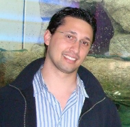

Tekin Bicer is an Assistant Computer/Computational Scientist at Mathematics and Computer Science (MCS) division at Argonne National Laboratory. He also holds a joint appointment in Advanced Photon Source (APS). Currently, he is working on large-scale high performance systems that deal with computationally intensive synchrotron light source data analysis problems. Tekin provides expertise on streaming analysis and light source workflows. He will work on implementing the streaming framework and the associated experiments and data collection.

---
[Sven Leyffer, Argonne National Laboratory](http://wiki.mcs.anl.gov/leyffer/index.php/Sven_Leyffer) (RAMSES-1)

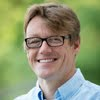

Sven is interested in the development of reliable methods for solving large-scale nonlinear optimization problems and in the implementation and analysis of filter type algorithms. This forms the basis from which I am extending nonlinear optimization methodologies to emerging areas such as mixed-integer nonlinear optimization and optimization problems with complementarity constraints.

---
[Zhengchun Liu](http://zliu.info), [Argonne National Laboratory](http://www.mcs.anl.gov/~zcliu/) (RAMSES-1 and RAMSES-2)

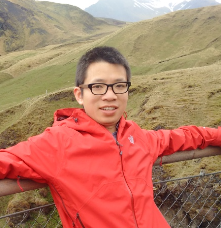

Zhengchun Liu is a postdoctoral appointee at the Mathematics and Computer Science Division, Argonne National Laboratory. In this project, he develops end-to-end analytical performance models to transform understanding of the behavior of science workflows in extreme-scale science environments. More specifically, these models are developed to predict the behavior of a science workflow before it is implemented, to explain why performance does not meet design goals, and to architect science environments to meet workflow needs.

---
[Todd Munson, Argonne National Laboratory](http://www.mcs.anl.gov/~tmunson/) (RAMSES-1 and RAMSES-2)

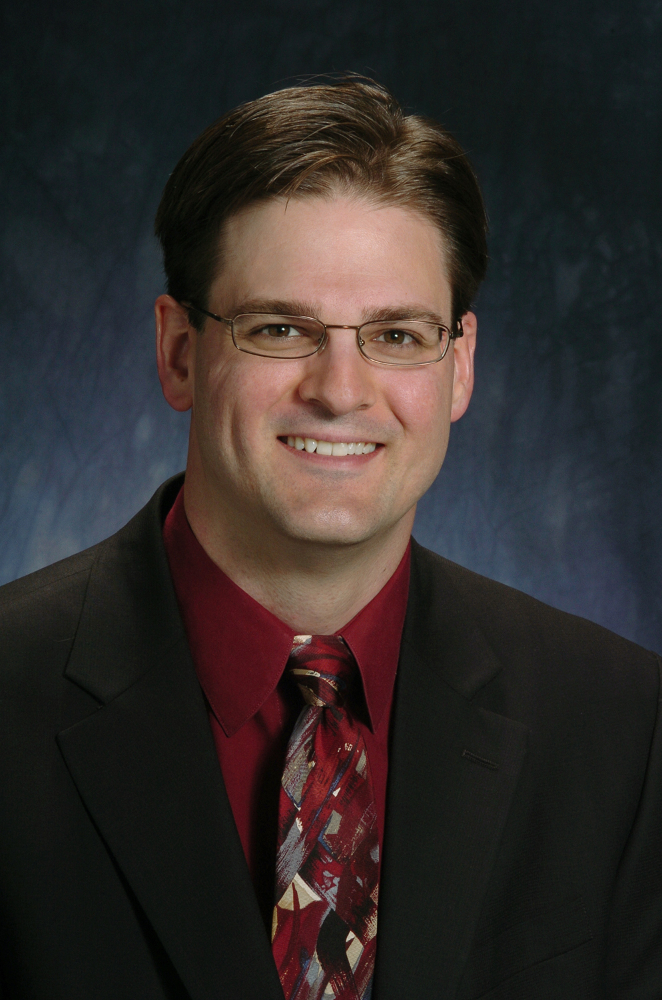

Todd is interested in large-scale optimization methods for simulation constrained optimization problems using high-performance architectures, hierarchical optimization problems with discrete choices, and nonsmooth dynamical systems including differential variational inequalities and complementarity constraints.  His primary contribution to this project is in using numerical optimization to estimate model parameters based on available data.

---
[Vitali Morozov, Argonne National Laboratory](http://www.alcf.anl.gov/staff-directory/vitali-morozov) (RAMSES-1)

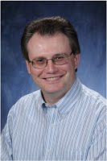

Vitali Morozov is a Principal Application Performance Engineer at the Argonne Leadership Computing Facility. At Argonne since 2001, he has been working on computer simulation of plasma generation, plasma material interactions, plasma thermal and optical properties, and applications to laser and discharge-produced plasmas. At the ALCF, he has been working on performance projections and studying the hardware trends in high performance computing, as well as porting and tuning applications on supercomputers.

---
[Venkatram Vishwanath, Argonne National Laboratory](http://www.mcs.anl.gov/person/venkatram-vishwanath) (RAMSES-1)

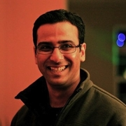

Venkatram Vishwanath is a computer scientist  at the Argonne National Laboratory. His research interests span the areas of large-scale data movement and management, scalable data analysis and visualization, in situ analytics, and performance modeling.  In RAMSES, he leads the performance modeling and performance projections for exascale simulations and in situ workflows on current and future supercomputing systems.
 
---
